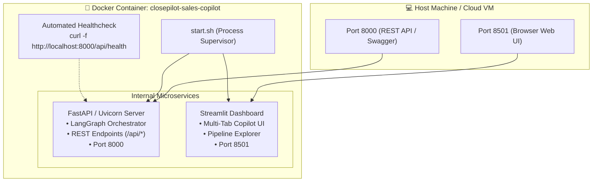

# 🐳 ClosePilot • Docker Deployment & Operations Guide

This guide details how to build, run, test, and orchestrate **ClosePilot (AI Sales Follow-Up Copilot)** using Docker and Docker Compose.

---

## 📑 Table of Contents
- [1. Container Architecture](#1-container-architecture)
- [2. Prerequisites](#2-prerequisites)
- [3. Quick Start (1-Command Launch)](#3-quick-start-1-command-launch)
- [4. Container Port Mappings](#4-container-port-mappings)
- [5. Environment Variables Configuration](#5-environment-variables-configuration)
- [6. Docker Lifecycle & Management](#6-docker-lifecycle--management)
- [7. Production Cloud Container Deployment](#7-production-cloud-container-deployment)
- [8. Troubleshooting & Diagnostics](#8-troubleshooting--diagnostics)

---

## 1. Container Architecture

ClosePilot packages both the **FastAPI REST Engine** and the **Streamlit Sales Dashboard** inside an optimized `python:3.12-slim` image using a non-blocking entrypoint process supervisor ([`start.sh`](file:///d:/sales%20agent/start.sh)):



---

## 2. Prerequisites

* **Docker Engine** `>= 24.0.0`
* **Docker Compose** `>= v2.20.0`
* A configured [`.env`](file:///d:/sales%20agent/.env) file (see [`.env.example`](file:///d:/sales%20agent/.env.example))

---

## 3. Quick Start (1-Command Launch)

### Step 1: Clone and Prepare Environment
```bash
git clone https://github.com/srinath2934/closepilot.git
cd closepilot

# Copy the environment template
cp .env.example .env
# Edit .env with your NVIDIA/Groq, HubSpot, and Supabase credentials
```

### Step 2: Build & Start Container
```bash
docker compose up -d --build
```

### Step 3: Access Live Services
* 🖥️ **Streamlit Sales UI**: [`http://localhost:8501`](http://localhost:8501)
* 🔌 **FastAPI Swagger Docs**: [`http://localhost:8000/docs`](http://localhost:8000/docs)
* 🩺 **Backend Health API**: [`http://localhost:8000/api/health`](http://localhost:8000/api/health)

---

## 4. Container Port Mappings

| Port | Service | Protocol | Description |
|---|---|---|---|
| **`8501`** | Streamlit UI | HTTP / WebSocket | Interactive AI sales copilot dashboard |
| **`8000`** | FastAPI Engine | HTTP / REST | OpenAPI docs, workflow endpoints, and OAuth |

---

## 5. Environment Variables Configuration

Docker automatically injects all variables from your local [`.env`](file:///d:/sales%20agent/.env) file into the container:

```bash
# LLM Provider Configuration
LLM_PROVIDER=nvidia
LLM_MODEL=meta/llama-3.1-70b-instruct
NVIDIA_API_KEY=nvapi-your-key-here
NVIDIA_BASE_URL=https://integrate.api.nvidia.com/v1

# HubSpot CRM Integration
HUBSPOT_APP_ID=your_hubspot_app_id
HUBSPOT_CLIENT_ID=your_hubspot_client_id
HUBSPOT_CLIENT_SECRET=your_hubspot_client_secret
HUBSPOT_ACCESS_TOKEN=your_hubspot_access_token
HUBSPOT_USE_MOCK=false

# Supabase Persistence
SUPABASE_URL=https://your-project.supabase.co
SUPABASE_KEY=your-supabase-key

# LangSmith Tracing & Observability
LANGCHAIN_TRACING_V2=true
LANGCHAIN_ENDPOINT=https://api.smith.langchain.com
LANGCHAIN_API_KEY=your-langsmith-key
LANGCHAIN_PROJECT=closepilot
```

---

## 6. Docker Lifecycle & Management

### Inspect Running Containers
```bash
docker compose ps
```

### View Live Streaming Logs
```bash
# Stream combined logs
docker compose logs -f

# Stream only the last 100 lines
docker compose logs --tail=100 -f
```

### Execute Commands Inside Container
```bash
# Open interactive bash terminal
docker compose exec sales-agent bash

# Run test suite inside container environment
docker compose exec sales-agent pytest tests/ -v
```

### Restart / Stop Containers
```bash
# Restart container
docker compose restart

# Stop container without removing volumes
docker compose stop

# Teardown container completely
docker compose down
```

---

## 7. Production Cloud Container Deployment

### Option A: AWS Elastic Container Service (ECS / Fargate)
1. Build and tag the Docker image:
   ```bash
   docker build -t closepilot .
   docker tag closepilot:latest <aws_account_id>.dkr.ecr.<region>.amazonaws.com/closepilot:latest
   ```
2. Push image to Amazon ECR:
   ```bash
   docker push <aws_account_id>.dkr.ecr.<region>.amazonaws.com/closepilot:latest
   ```
3. Create an ECS Task Definition exposing ports `8000` and `8501` behind an Application Load Balancer (ALB).

### Option B: Google Cloud Run
```bash
# Submit build to Google Artifact Registry
gcloud builds submit --tag gcr.io/[PROJECT-ID]/closepilot

# Deploy to Cloud Run
gcloud run deploy closepilot \
  --image gcr.io/[PROJECT-ID]/closepilot \
  --platform managed \
  --region us-central1 \
  --allow-unauthenticated \
  --port 8000
```

### Option C: Standalone VPS with Nginx Reverse Proxy
```nginx
# /etc/nginx/sites-available/closepilot
server {
    server_name sales.yourdomain.com;

    location / {
        proxy_pass http://127.0.0.1:8501;
        proxy_http_version 1.1;
        proxy_set_header Upgrade $http_upgrade;
        proxy_set_header Connection "upgrade";
        proxy_set_header Host $host;
    }

    location /api/ {
        proxy_pass http://127.0.0.1:8000;
        proxy_set_header Host $host;
        proxy_set_header X-Real-IP $remote_addr;
    }
}
```

---

## 8. Troubleshooting & Diagnostics

| Issue | Root Cause | Solution |
|---|---|---|
| **Port 8000 or 8501 already in use** | A local process is occupying the port. | Stop local instances: `kill -9 $(lsof -t -i:8000)` or change port mapping in `docker-compose.yml` (e.g. `"8080:8000"`). |
| **`UNHEALTHY` container status** | FastAPI failed to start or HubSpot key is invalid. | Run `docker compose logs` to inspect traceback. Verify credentials in `.env`. |
| **Streamlit WebSocket Disconnect** | Reverse proxy or load balancer dropping WebSockets. | Ensure your proxy passes `Upgrade` and `Connection: upgrade` headers. |
| **Database connection refused** | Supabase URL unreachable. | Confirm outbound internet access from Docker daemon and verify `SUPABASE_URL`. |

---

*ClosePilot • Autonomous AI Sales Follow-Up Copilot*
