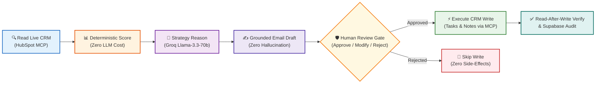
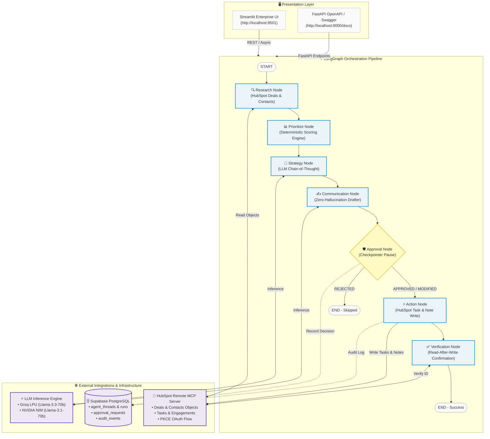

# ⚡ ClosePilot • AI Sales Follow-Up Copilot

> **Enterprise-Grade Autonomous CRM Investigation, Deterministic Opportunity Prioritization, Strategic Reasoning, and Human-in-the-Loop Execution.**

[](https://python.org)
[](https://github.com/langchain-ai/langgraph)
[](https://developers.hubspot.com/)
[](https://groq.com)
[](https://fastapi.tiangolo.com)
[](https://streamlit.io)
[](https://pytest.org)

---

## 📑 Table of Contents
- [1. Executive Summary](#1-executive-summary)
- [2. The Business Problem](#2-the-business-problem)
- [3. The Proposed Solution](#3-the-proposed-solution)
- [4. High-Level System Architecture](#4-high-level-system-architecture)
- [5. Detailed Multi-Agent Workflow](#5-detailed-multi-agent-workflow)
- [6. Deterministic Prioritization Formula](#6-deterministic-prioritization-formula)
- [7. Safety, Guardrails & Zero-Hallucination Policy](#7-safety-guardrails--zero-hallucination-policy)
- [8. Repository File Structure](#8-repository-file-structure)
- [9. Getting Started & Installation](#9-getting-started--installation)
- [10. REST API Reference](#10-rest-api-reference)
- [11. Automated Testing & Verification](#11-automated-testing--verification)

---

## 1. Executive Summary

In enterprise B2B sales, account executives manage dozens of simultaneous deals spread across complex sales cycles. High-value opportunities stall due to missing follow-ups, unclear buyer requirements, or lack of timely action after proposals are dispatched. 

**GWC AI Sales Intelligence Copilot** is a stateful multi-agent system built on **LangGraph**, **Model Context Protocol (MCP)**, and **Groq / NVIDIA LLMs**. It continuously audits live CRM pipelines (HubSpot), calculates deterministic urgency scores based on deal velocity and inactivity decay, generates context-grounded strategic outreach, and safely pauses at a **Human-in-the-Loop (HITL) gate** before executing verified CRM writes.

---

## 2. The Business Problem

Traditional sales workflows suffer from five fundamental breakdowns:

1. **Pipeline Blindspots & Inactivity Decay**: High-value enterprise deals often stall silently because sales reps lack automated, real-time alerts when high-intent opportunities (e.g. *Contract Sent*) go untouched for days.
2. **Context Fragmentation**: Deal values, stakeholder objections, and customer requirements are scattered across meeting notes, CRM history, and email threads.
3. **Generic, Impersonal Outreach**: Reps resort to generic templates that ignore specific buyer blockers (e.g., CFO milestone questions or custom SLA terms), reducing conversion rates.
4. **Autonomous AI Risk**: Purely autonomous agents can hallucinate discounts, fabricate non-existent meetings, or spam decision-makers with incorrect pricing.
5. **Inconsistent CRM Hygiene**: Even when follow-ups happen, reps frequently forget to log tasks and notes back into the CRM, breaking team visibility.

---

## 3. The Proposed Solution

The GWC AI Sales Agent solves these challenges through a **hybrid deterministic-reasoning architecture**:



* **Deterministic Prioritization**: Fast mathematical scoring rank-orders deals by stage weights, contract sizes, and days inactive without token consumption or hallucination.
* **Grounded LLM Reasoning**: Strategic analysis and zero-hallucination email drafting strictly constrained to verified CRM facts.
* **Human-in-the-Loop Gate**: The workflow hard-interrupts before any write operation, giving sales reps full authority to review, edit, approve, or reject outreach.
* **Read-After-Write Verification**: After write execution, the system queries the CRM to verify external state persistence.
* **Immutable Audit Trail**: Telemetry, approval decisions, and agent runs are logged into Supabase PostgreSQL for compliance.

---

## 4. High-Level System Architecture



---

## 5. Detailed Multi-Agent Workflow

| Node / Agent | Responsibility | Implementation File |
|---|---|---|
| **1. Research Agent** | Connects to HubSpot MCP to ingest deals, contact associations, modification timestamps, and CRM notes. | [`app/graph/nodes/research.py`](file:///d:/sales%20agent/app/graph/nodes/research.py) |
| **2. Prioritization Engine** | Computes mathematical priority scores; matches custom prompt query intent and entities. | [`app/graph/nodes/prioritize.py`](file:///d:/sales%20agent/app/graph/nodes/prioritize.py) |
| **3. Strategy Agent** | Analyzes deal blockers, buyer persona drivers (CXO vs. Director), and determines optimal next actions. | [`app/graph/nodes/strategy.py`](file:///d:/sales%20agent/app/graph/nodes/strategy.py) |
| **4. Communication Drafter** | Drafts personalized, factual follow-up emails adhering to strict anti-invention guardrails. | [`app/graph/nodes/communication.py`](file:///d:/sales%20agent/app/graph/nodes/communication.py) |
| **5. Human Approval Gate** | LangGraph checkpointer pause point (`interrupt_before=["approval"]`) for human review. | [`app/graph/nodes/approval.py`](file:///d:/sales%20agent/app/graph/nodes/approval.py) |
| **6. Action Agent** | Executes approved write operations (creates HubSpot tasks and engagement notes). | [`app/graph/nodes/action.py`](file:///d:/sales%20agent/app/graph/nodes/action.py) |
| **7. Verification Agent** | Performs read-after-write verification to confirm CRM object existence and status. | [`app/graph/nodes/verification.py`](file:///d:/sales%20agent/app/graph/nodes/verification.py) |

---

## 6. Deterministic Prioritization Formula

The Prioritization Engine computes priority urgency without LLM variance:

$$\text{Priority Score} = S_{\text{stage}} + V_{\text{amount}} + I_{\text{inactivity}} - P_{\text{task}} - P_{\text{recent}} + B_{\text{query}}$$

### Scoring Parameters:
* **Stage Weights ($S_{\text{stage}}$)**:
  * Contract Sent: $+35\text{ pts}$
  * Decision Maker Bought-In: $+30\text{ pts}$
  * Proposal Submitted: $+25\text{ pts}$
  * Qualified to Buy: $+15\text{ pts}$
  * Presentation Scheduled: $+10\text{ pts}$
* **Deal Value ($V_{\text{amount}}$)**:
  * $\ge \$50,000$ (Tier-1 Enterprise): $+30\text{ pts}$
  * $\$20,000 - \$49,999$ (Mid-Market): $+20\text{ pts}$
  * $\$10,000 - \$19,999$ (Qualified): $+10\text{ pts}$
* **Inactivity Urgency ($I_{\text{inactivity}}$)**:
  * For $\text{days} \ge 3$: $\min(\text{days} \times 5, 30)\text{ pts}$
* **Safety Penalties**:
  * Existing scheduled task ($P_{\text{task}}$): $-40\text{ pts}$
  * Contacted within last 48 hours ($P_{\text{recent}}$): $-50\text{ pts}$
* **Prompt Query Match ($B_{\text{query}}$)**:
  * Exact match on company/contact/deal name in user prompt: $+100\text{ pts}$
  * Stage keyword match: $+40\text{ pts}$

---

## 7. Safety, Guardrails & Zero-Hallucination Policy

The system enforces enterprise AI safety standards:

1. **Anti-Invention Guardrails**:
   * Prompts explicitly prohibit hallucinating unapproved discounts, unauthorized pricing, or phantom meetings.
2. **Deterministic Hard Boundary**:
   * Deal ranking and prioritization are computed in deterministic Python code rather than LLM guessing.
3. **No Unattended CRM Writes**:
   * No tool or agent has autonomous write privileges without passing through the Human Approval Gate.
4. **Graceful Degradation / Circuit Breaker**:
   * If live HubSpot OAuth tokens expire, the system smoothly falls back to sandbox data with clear UI warnings rather than crashing.

---

## 8. Repository File Structure

```
d:/sales agent/
├── app/
│   ├── config/              # Centralized environment configuration (Pydantic Settings)
│   │   └── settings.py      # Dynamic .env reload, multi-provider configuration
│   ├── llm/                 # Unified LLM Provider Interface
│   │   └── provider.py      # Groq LPU, NVIDIA NIM, OpenAI, and Mock providers
│   ├── mcp/                 # Model Context Protocol Tools Layer
│   │   ├── client.py        # Base MCP tool execution interface
│   │   └── hubspot.py       # Live HubSpot REST/MCP client with PKCE OAuth & sandbox
│   ├── graph/               # LangGraph Stateful Agent Workflow
│   │   ├── state.py         # Type-safe SalesState schema
│   │   ├── graph.py         # StateGraph with checkpointer & interrupt_before=["approval"]
│   │   └── nodes/           # Single-responsibility agent nodes
│   │       ├── research.py  # Ingests deals, contacts, notes from HubSpot
│   │       ├── prioritize.py# Deterministic scoring engine + query matching
│   │       ├── strategy.py  # Chain-of-thought sales strategy reasoning
│   │       ├── communication.py # Zero-hallucination email drafter
│   │       ├── approval.py  # Human approval pause gate
│   │       ├── action.py    # HubSpot task & note write executor
│   │       └── verification.py # Read-after-write confirmation
│   ├── prompts/             # Guardrailed Prompt Engineering
│   │   ├── strategy_prompts.py
│   │   └── communication_prompts.py
│   ├── database/            # Persistence & Compliance Audit Trail
│   │   ├── connection.py    # Supabase PostgREST async client with circuit breaker
│   │   └── repositories/    # Audit, Approval, and Run telemetry repositories
│   └── main.py              # FastAPI REST API (PKCE OAuth, Health, Workflow Lifecycle)
├── frontend/
│   └── app.py               # Streamlit Enterprise Multi-Tab Dashboard
├── scripts/
│   └── seed_crm.py          # Direct CRM deal & contact seeding script
├── tests/
│   ├── unit/                # Scoring algorithm & repository unit tests
│   └── integration/         # API, graph lifecycle & multi-scenario integration tests
├── run_demo.py              # Standalone CLI validation runner
└── requirements.txt         # Pinned production dependencies
```

---

## 9. Getting Started & Installation

### Prerequisites
* Python 3.11+
* [uv](https://github.com/astral-sh/uv) (recommended) or standard `pip`
* HubSpot Developer Account (optional for live mode; mock mode works out of the box)
* Groq API Key or NVIDIA NIM API Key

### Step 1: Clone and Install Dependencies
```bash
# Using uv (fastest)
uv sync

# Or using standard pip
pip install -r requirements.txt
```

### Step 2: Configure Environment Variables
Create a `.env` file in the project root:
```env
# LLM Provider: groq | nvidia | openai | mock
LLM_PROVIDER=groq
LLM_MODEL=llama-3.3-70b-versatile
GROQ_API_KEY=gsk_your_groq_api_key_here

# HubSpot Integration
HUBSPOT_APP_ID=your_hubspot_app_id
HUBSPOT_CLIENT_ID=your_hubspot_client_id
HUBSPOT_CLIENT_SECRET=your_hubspot_client_secret
HUBSPOT_ACCESS_TOKEN=your_access_token_here
HUBSPOT_USE_MOCK=false

# Supabase Persistence (Optional)
SUPABASE_URL=https://your-project.supabase.co
SUPABASE_KEY=your_supabase_publishable_key

# Backend Server
BACKEND_HOST=127.0.0.1
BACKEND_PORT=8000
```

### Step 3: Run the Backend & Streamlit Dashboard

**Terminal 1 — FastAPI Backend:**
```bash
uv run uvicorn app.main:app --port 8000 --reload
```

**Terminal 2 — Streamlit Dashboard:**
```bash
uv run streamlit run frontend/app.py --server.port 8501
```

Open **`http://localhost:8501`** in your browser.

---

## 10. REST API Reference

The FastAPI backend runs on `http://127.0.0.1:8000` with interactive Swagger docs at `/docs`:

| Method | Endpoint | Description |
|---|---|---|
| `GET` | `/` | Service health and active MCP/LLM mode summary. |
| `GET` | `/api/health` | Comprehensive connection diagnostics for HubSpot & Supabase. |
| `GET` | `/api/settings` | Current configuration details (redacted keys). |
| `GET` | `/api/deals` | Ingests all active raw deals from HubSpot CRM. |
| `POST`| `/api/deals/seed` | Dynamically creates a new deal in HubSpot CRM. |
| `POST`| `/api/workflow/start` | Initiates LangGraph agent run; executes through Research $\rightarrow$ Prioritize $\rightarrow$ Strategy $\rightarrow$ Communication, then pauses at Human Approval. |
| `POST`| `/api/workflow/approve` | Submits human approval/modifications and resumes execution through Action $\rightarrow$ Verification $\rightarrow$ END. |
| `GET` | `/api/workflow/status/{thread_id}` | Retrieves full checkpoint state for an active workflow thread. |
| `GET` | `/oauth/login` | Initiates HubSpot PKCE OAuth authorization. |
| `GET` | `/oauth/callback` | Exchanges authorization code for live HubSpot access token. |

---

## 11. Automated Testing & Verification

The test suite covers unit logic, repository persistence, API lifecycle, and end-to-end multi-scenario agent flows:

```bash
uv run pytest tests/ -v
```

### Verified Test Matrix (14/14 Passing):
* ✅ `test_api_root` — Root endpoint sanity
* ✅ `test_api_deals` — Live deals retrieval
* ✅ `test_api_workflow_lifecycle` — Complete start $\rightarrow$ approve $\rightarrow$ complete REST lifecycle
* ✅ `test_end_to_end_graph_execution` — LangGraph checkpointer pause and resume
* ✅ `test_scenario_1_standard_flow` — End-to-end standard sales inquiry
* ✅ `test_scenario_2_custom_prompt_targeting` — Prompt entity matching & $+100\text{ pt}$ score boost
* ✅ `test_scenario_3_deal_switching_synchronization` — UI opportunity switcher checkpointer synchronization
* ✅ `test_scenario_4_rejection_safety` — Rejection handling without write execution
* ✅ `test_scenario_5_human_draft_modification` — Custom subject/body preservation on write
* ✅ `test_runs_repository` — Thread & telemetry logging
* ✅ `test_audit_repository` — Event-level audit logging
* ✅ `test_high_value_contract_sent_scoring` — Mathematical scoring verification
* ✅ `test_recent_contact_penalty` — $-50\text{ pt}$ penalty for recent touchpoints
* ✅ `test_future_task_penalty` — $-40\text{ pt}$ penalty for existing scheduled tasks

---

### Standalone CLI Execution
Run the standalone end-to-end execution script anytime without browser overhead:
```bash
uv run python run_demo.py
```

---

*Built with ❤️ by the GWC Data.AI Team.*
